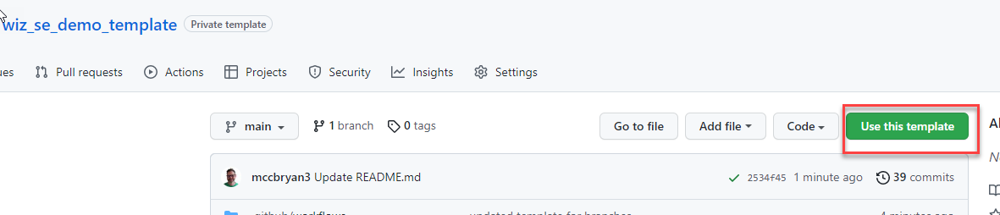
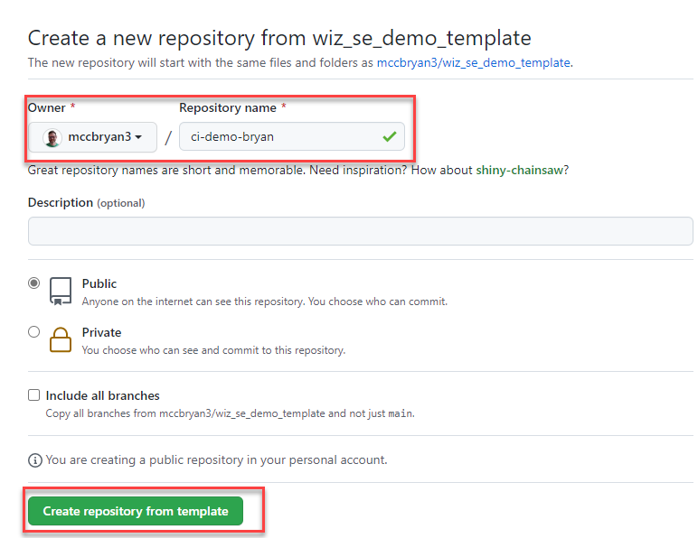
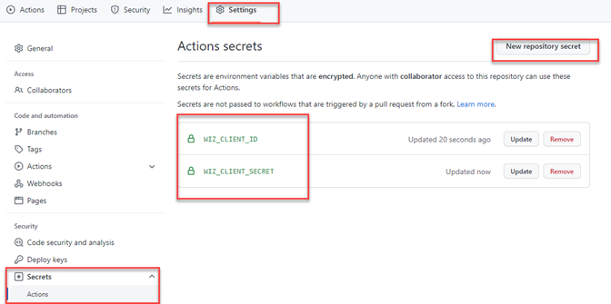

# Wiz SE Demo Repository - Github

### Description
This repository is dedicated to providing a starting point for SE demos using CI integration for WizCLI

## Requirements

* Github Account
* Wiz Service Account (`security_scan:create`)
* Ability to work with branches in Git

### OPTIONAL - Supporting requirements for dev machine

* Git installed
* VS Code
* Wiz-CLI
* AWSCLI installed and operational
* Azure CLI installed and operational
* Terraform >= 1.0 installed and operational
* Docker installed and running

## Basic Setup

1. Create a new repository from the template repository



2. Set repository target and name (customize name to fit your needs)



4. Get coffee

☕️ Template cleanup process takes a few minutes

5. Check for branches


6. Recreate repository secrets (obtained from Wiz service account `security_scan:create`)
  * WIZ_CLIENT_ID
  * WIZ_CLIENT_SECRET


## Basic Usage

This repo is configured to have the following branches

* container-pass
* container-fail
* iac-pass
* iac-fail
* main

The main branch is the protected branch which will be the target of all pull requests.

The guthub actions located in `.github/workflows` will provide the required actions during PRs

The `iac` branch will use the `wiz-scan-iac.yaml` action and the `container` branch will use the `wiz-scan-container.yaml` action.

### OPTIONAL - VS Code Setup

Clone down a local copy of the repo and add it to VS Code
Verify that you have all of the required branches

```
> git fetch
> git branch
  container-pass
  iac-pass
  container-fail
  iac-fail
* main
```
Use the git checkout command to swicth between branches
```
> git checkout iac
Switched to branch 'iac-pass'
Your branch is up to date with 'origin/iac-pass'.
```
### Container Scanning

<b>Inventory</b></br>
| Item | Purpose|
--------|--------|
|secret.yaml| Contains secret in yaml|
|Dockerfile| Image build instructions|
|awssecret.txt|Contains secret in text|

### IaC Scanning

<b>Inventory</b></br>
| Folder | Purpose|
--------|--------|
|`aws/terraforn-eks`| Terraform instructions to build an EKS cluster |
|`azure/terraform-aks`| Terraform instruction to build an AKS cluster|

### Rebasing branches

Due to drift in the branches you may find that you need to rebase your banches back to main.

The below example will `rebase` your branch with the `main` branch bringing it in direct sync with the `main` branch.

NOTE: This will `stash` any changes you have in this branch!!

```
> git checkout <branch>
> git stash
> git rebase origin/main
> git push --force
```

